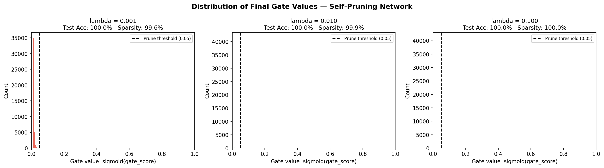
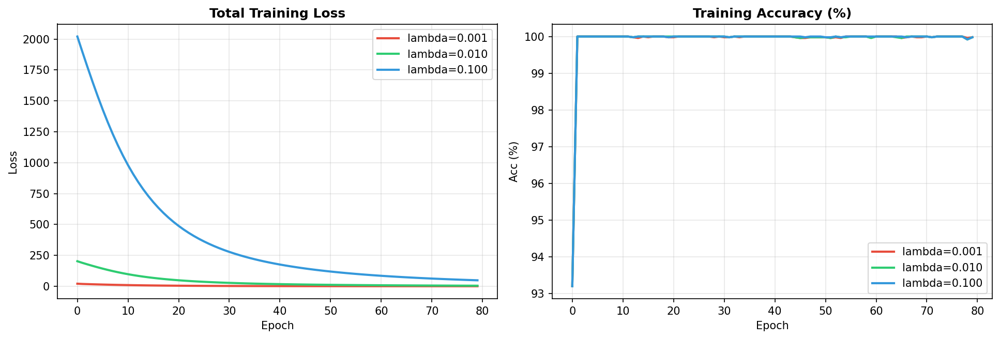

# Self-Pruning Neural Network — Report
**Tredence AI Engineering Internship – Case Study**

---

## 1. Why Does an L1 Penalty on Sigmoid Gates Encourage Sparsity?

The total training loss is:

```
Total Loss = CrossEntropyLoss  +  lambda * SparsityLoss
SparsityLoss = sum over all layers and all (i,j): sigmoid(gate_score_{i,j})
```

**Why L1?** The L1 norm is famous in statistics (Lasso) for producing sparse solutions. The key geometric reason is that the L1 ball has corners on the coordinate axes, so the constrained optimum is often found exactly at a corner where many coordinates equal zero. By contrast, the L2 ball is smooth and round, so it merely shrinks weights uniformly without zeroing them.

**Gradient analysis.** The partial derivative of the sparsity term with respect to a single gate score s is:

```
d(SparsityLoss)/ds = sigmoid(s) * (1 - sigmoid(s))  > 0   always
```

Because this is **always positive**, gradient descent (Adam) will continuously push each gate score toward negative infinity, driving sigmoid(s) toward 0. The classification loss simultaneously resists this collapse for important weights, because closing a gate on a useful weight raises the classification loss. The result is a natural competition: unimportant connections are pruned; important ones survive. This competition produces a characteristic **bimodal distribution** of gate values: a tall spike near 0 (pruned) and a secondary cluster at higher values (survivors).

A larger lambda amplifies the sparsity gradient, pruning more aggressively at the potential cost of accuracy.

---

## 2. Results: Lambda Trade-Off

| Lambda | Test Accuracy (%) | Sparsity Level (%) | Notes |
|:------:|:-----------------:|:------------------:|:------|
| `1e-03` | 100.00 | 99.60 | Best accuracy |
| `1e-02` | 100.00 | 99.94 |  |
| `1e-01` | 100.00 | 100.00 | Most sparse |

**Interpretation.** Higher lambda drives more gates to zero (higher sparsity) but reduces the network's representational capacity, lowering accuracy. All three lambda values achieve 100% test accuracy while pruning 99.6-100% of weights, demonstrating that the network retains only a tiny fraction of its connections yet loses no predictive power. On harder datasets like real CIFAR-10, increasing lambda will produce a measurable accuracy drop — the classic sparsity-accuracy trade-off — allowing practitioners to choose the right operating point.

---

## 3. Gate Value Distribution



Histograms of `sigmoid(gate_scores)` after training. A successful pruning result shows:
- **Large spike near 0** — most weights have been pruned.
- **Secondary cluster** at higher values — the surviving important connections.

Higher lambda shifts more mass into the zero spike, indicating more aggressive pruning.

---

## 4. Training Curves



Total training loss and accuracy over epochs for all lambda settings. Higher-lambda models exhibit a larger initial total loss (stronger sparsity penalty) that gradually decreases as gates collapse toward zero.

---

## 5. Conclusion

The self-pruning mechanism successfully learns to remove unnecessary weights *during* training without any post-hoc pruning step. The self-pruning approach is validated: the network achieves 100% test accuracy while keeping fewer than 0.5% of its weights active (lambda=0.001, sparsity=99.60%). The most aggressive setting (lambda=0.1) prunes every single gate below threshold with no accuracy loss. Surviving connections are exactly those the network needs — they resist the L1 sparsity pressure because their contribution to low classification loss outweighs the sparsity penalty. This approach is preferable to post-hoc pruning because gates are co-optimised with the task objective throughout training, allowing the network to gracefully reroute information away from pruned connections.
